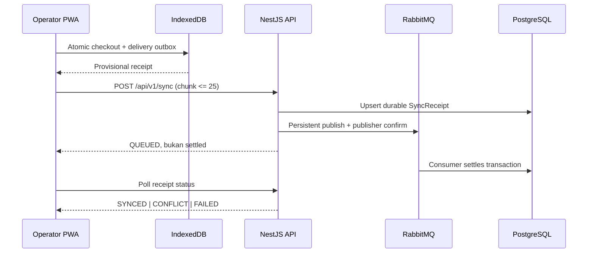

# K-POS

**Offline-first POS untuk counter yang tetap harus jualan saat koneksi hilang.**

[](https://github.com/myudak/compos/actions/workflows/ci.yml)


K-POS memisahkan pengalaman tiap aktor tanpa memecah backend menjadi microservices: Operator PWA
untuk checkout offline, Entry PWA untuk catalog dan stock, serta Owner PWA untuk control dan
reporting. PostgreSQL adalah canonical ledger; RabbitMQ menangani settlement async yang durable.

[Kenapa offline-first](#kenapa-offline-first) · [Cara sync](#cara-sync) ·
[Arsitektur](#arsitektur) · [Quick start](#quick-start) · [Demo](#demo) ·
[Quality](#quality) · [Playbook](docs/README.md)

## Kenapa offline-first

Checkout tidak boleh gagal hanya karena backend atau internet sedang tidak reachable. Saat Operator
menekan bayar, K-POS menyimpan transaction, delivery outbox, local stock projection, dan draft
cleanup dalam **satu IndexedDB transaction**. Receipt lokal baru muncul setelah commit tersebut
berhasil.

Tiga jaminan utamanya:

- local checkout atomic dan tidak menunggu network;
- delivery bersifat at-least-once, sementara efek transaksi di backend exactly-once;
- settled transaction immutable; void/correction selalu append-only dan auditable.

## Cara sync



Identitas idempotency adalah `(device_id, offline_uuid)` plus canonical payload hash. Retry payload
yang sama me-reuse receipt; ID yang sama dengan payload berbeda ditolak `409`. Detail lengkap ada di
[sync protocol](docs/sync_protocol.md).

## Arsitektur

```text
apps/operator-web   /        offline-first checkout
apps/entry-web      /entry/  catalog dan inventory
apps/owner-web      /owner/  users, devices, exceptions, reporting
packages/api-client          pinned OpenAPI + validated runtime client
../k-pos-be                  canonical NestJS backend
```

Hosted demo memakai Nginx sebagai same-origin gateway. `/api/v1`, `/health`, dan `/metrics` menuju
NestJS; tiga path PWA mendapat SPA fallback dan service-worker scope terpisah.

| Boundary         | Pilihan                                                  |
| ---------------- | -------------------------------------------------------- |
| UI               | React 19, Vite, TypeScript, installable PWA              |
| Local durability | Dexie / IndexedDB                                        |
| Contract         | backend OpenAPI, pinned generated TypeScript client      |
| API              | NestJS, Prisma, PostgreSQL                               |
| Async settlement | RabbitMQ persistent messages, confirm, retry queues, DLQ |
| Browser E2E      | Playwright against production Docker build               |

## Quick start

Butuh Node.js 22+, pnpm 10, npm, dan Docker Desktop. Letakkan kedua repository sebagai sibling:

```text
workspace/
  project_COMPPOS/  # repository frontend ini
  k-pos-be/         # backend canonical
```

Lalu dari repository frontend:

```bash
pnpm install
pnpm stack:up
```

Buka `http://localhost:8080`, `http://localhost:8080/entry/`, atau
`http://localhost:8080/owner/`. RabbitMQ Management tersedia di `http://localhost:15672`.

Untuk hot reload, jalankan PostgreSQL/RabbitMQ/API dari backend lalu `pnpm dev`; port lokal adalah
Operator `5173`, Entry `5174`, Owner `5175`, dan API `3001`.

## Demo

Seed deterministik menyediakan:

| App      | Email                      | Password      | Device             |
| -------- | -------------------------- | ------------- | ------------------ |
| Operator | `operator@kedai-nusa.test` | `operator123` | `KPOS-DEMO-DEVICE` |
| Entry    | `entry@kedai-nusa.test`    | `entry123`    | —                  |
| Owner    | `owner@kedai-nusa.test`    | `owner123`    | —                  |

Coba matikan network browser, checkout, reload tab, lalu hidupkan network. Sale tetap ada dan status
bergerak `PROVISIONAL → QUEUED → SETTLED`. Untuk walkthrough lengkap baca
[demo guide](docs/demo_guide.md).

## Payment dan reconciliation

Semua metode (`CASH`, `STATIC_QRIS`, `BANK_TRANSFER`) langsung `VERIFIED` setelah Operator mengecek
pembayaran. Reconciliation **bukan approval wajib**. Owner hanya membuka case ketika ada masalah:

```text
VERIFIED -> OPEN case -> RESOLVED_VALID   (transaction tetap)
                      -> RESOLVED_INVALID (payment FAILED + append-only void)
```

## Quality

```bash
pnpm run ci             # format, docs, OpenAPI drift, lint, types, unit, build
pnpm test:integration   # real PostgreSQL + RabbitMQ backend flow
pnpm test:e2e           # production Docker + Playwright + Rabbit degraded mode
pnpm run ci:full
```

Green build membuktikan acceptance suite, bukan otomatis production readiness. Secrets management,
managed backup/PITR, restore drill, alerting, TLS, dan capacity validation tetap deployment concern.

## Dokumentasi

Mulai dari [project playbook](docs/README.md), lalu lanjut ke
[architecture](docs/system_architecture.md), [requirements](docs/functional_requirements.md),
[testing](docs/testing_strategy.md), dan [operations runbook](docs/operations_runbook.md).
