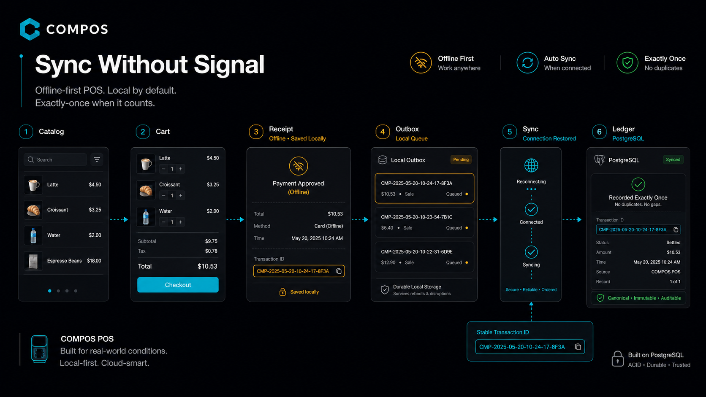
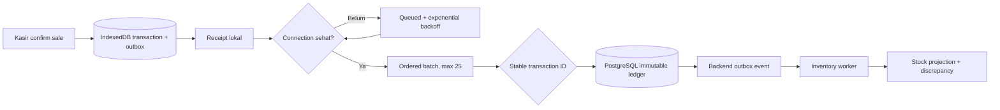
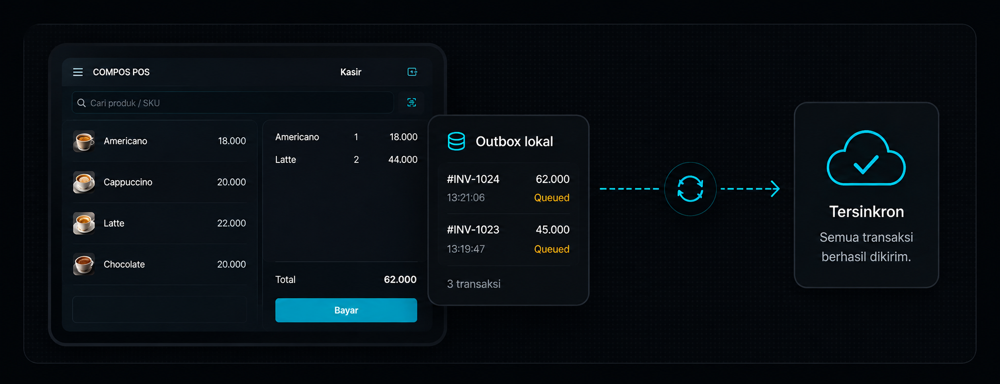

https://github.com/user-attachments/assets/8e7f4339-7f47-4fe9-8533-17880da089f4
<div align="center">
  

  <br />
  <br />

  <h1>COMPOS</h1>

  <p><strong>Kasir tetap jalan. Sinkron saat online.</strong></p>

  <p>
    COMPOS adalah point-of-sale offline-first untuk merchant yang harus tetap berjualan<br />
    saat koneksi tidak stabil, lalu sinkron otomatis ketika internet kembali.
  </p>

  <p>
    <a href="https://react.dev/"></a>
    <a href="https://fastify.dev/"></a>
    <a href="https://www.postgresql.org/"></a>
    
  </p>

  <p>
    <a href="#why-compos">Why COMPOS</a> ·
    <a href="#core-guarantees">Guarantees</a> ·
    <a href="#how-sync-works">Sync flow</a> ·
    <a href="#product-demo">Demo</a> ·
    <a href="#architecture">Architecture</a> ·
    <a href="#quick-start">Quick start</a> ·
    <a href="#one-click-demo">Deploy</a> ·
    <a href="#documentation">Docs</a>
  </p>
</div>

> [!IMPORTANT]
> “Transaksi berhasil saat offline” berarti sale, item snapshot, stock projection, dan local
> outbox sudah tersimpan atomically di device. Backend settlement baru terjadi ketika koneksi
> sehat. Transport boleh mengirim ulang, tetapi stable transaction ID dan idempotency membuat
> business effect tetap exactly-once.

## Why COMPOS

Koneksi counter UMKM, bazar, atau pop-up store tidak selalu stabil. POS yang bergantung penuh ke
request backend bisa membuat antrean berhenti tepat ketika kasir sedang ramai. COMPOS membalik
default tersebut: transaksi diselesaikan secara lokal dulu, lalu cloud mengejar state device ketika
koneksi kembali.

Project ini bukan mockup checkout. Repository-nya mencakup durable browser persistence, sync engine,
merchant-scoped Admin, immutable transaction ledger, reconciliation, PostgreSQL outbox worker,
automated failure scenarios, dan playbook engineering yang memetakan product requirement ke bukti.

## Core guarantees

| Guarantee                       | Implementasi nyata                                                                                                 |
| ------------------------------- | ------------------------------------------------------------------------------------------------------------------ |
| **Atomic local checkout**       | Transaction, item snapshots, outbox, stock projection, dan draft cleanup ditulis dalam satu Dexie transaction.     |
| **Durable queue**               | Confirmed sale tetap ada setelah reload, logout, auth expiry, network loss, dan abandoned `SYNCING` recovery.      |
| **Stable identity**             | Setiap sale memakai client-generated UUIDv7 yang tidak berubah saat retry atau berpindah batch.                    |
| **Idempotent settlement**       | ID + payload sama menjadi `ALREADY_PROCESSED`; reuse ID dengan payload berbeda ditolak tanpa overwrite history.    |
| **Partial batch isolation**     | Maksimal 25 due records dikirim per batch; satu item gagal tidak menggagalkan hasil item lain atau mengubah order. |
| **Immutable history**           | Settled transaction tidak diedit; correction dan audit event bersifat append-only.                                 |
| **Eventual inventory**          | Sale diterima lebih dulu, lalu worker menerapkan stock movement secara idempotent dan membuka discrepancy.         |
| **Offline authorization lease** | Checkout lokal boleh lanjut maksimal 72 jam sejak online authentication terakhir tanpa menghapus queued data.      |

## How sync works



Browser scheduler bereaksi pada startup, browser `online` event, manual reconnect, health probe, dan
interval. Sync service hanya mengambil outbox yang sudah due, single-flight, dan tidak menghapus
queue ketika token expired. Detail state transition, lost-response handling, dan retry policy ada di
[Sync Protocol](docs/sync_protocol.md).

## Product demo



https://github.com/user-attachments/assets/8e7f4339-7f47-4fe9-8533-17880da089f4

Demo utama yang perlu dibuktikan:

1. Login dan aktivasi device ketika online.
2. Matikan koneksi, lakukan checkout, lalu reload browser.
3. Receipt dan transaksi tetap ada dengan status queued.
4. Pulihkan koneksi dan lihat automatic settlement tanpa duplicate.
5. Login sebagai Admin untuk mencoba operator management, catalog pricing, correction, dan inventory
   reconciliation.

## Architecture

```text
apps/
  operator-web/   React 19 + Vite PWA, Dexie, Zustand, shadcn primitives
  api/            Fastify API, PostgreSQL repositories, outbox inventory worker
packages/
  contracts/      Canonical Zod wire schemas dan inferred TypeScript DTOs
docs/             Product, architecture, operations, testing, dan ADR playbook
```

| Layer                 | Technology                                                        |
| --------------------- | ----------------------------------------------------------------- |
| Operator application  | React 19, TypeScript, Vite 7, Tailwind CSS 4, PWA, Dexie, Zustand |
| API                   | Fastify 5, Zod contracts, JWT dengan server-side session `jti`    |
| Durable local state   | IndexedDB melalui Dexie                                           |
| Canonical persistence | PostgreSQL 17, explicit SQL repositories, transactional outbox    |
| Background processing | Independent Node.js inventory worker                              |
| Quality               | Vitest, fake IndexedDB, PostgreSQL integration suite, Playwright  |
| Tooling               | pnpm workspace, Oxlint, Oxfmt, GitHub Actions                     |

Beberapa keputusan penting sengaja konservatif: PWA dipilih sebelum React Native, PostgreSQL outbox
dipilih sebelum RabbitMQ, dan raw typed repositories dipertahankan sebelum menambah ORM. Alasan dan
trade-off lengkap ada di [Architecture Decision Records](docs/adr/README.md).

## Quick start

Requirements: Node.js 22+, pnpm 10, dan Docker Desktop/Compose.

```bash
git clone https://github.com/myudak/compos.git
cd compos

pnpm install --frozen-lockfile
pnpm db:up
pnpm db:reset
pnpm dev
```

Buka [http://localhost:5173](http://localhost:5173). `pnpm dev` menjalankan PWA, API di port `3001`,
dan inventory worker.

| Role  | Merchant     | Operator | PIN    |
| ----- | ------------ | -------- | ------ |
| Kasir | `KEDAI-NUSA` | `RANI`   | `1234` |
| Admin | `KEDAI-NUSA` | `ADMIN`  | `9999` |

Device activation code: `COMPOS-DEMO`.

> [!WARNING]
> `pnpm db:reset` menghapus schema PostgreSQL lokal. Guard bawaan hanya mengizinkan database bernama
> `operator_pos` atau `operator_pos_*`; jangan pernah menjalankannya ke production database.

## One-click demo

<a href="https://render.com/deploy?repo=https%3A%2F%2Fgithub.com%2Fmyudak%2Fcompos">
  
</a>

Render Blueprint membuat satu same-origin Fastify + PWA service, satu independent inventory worker,
dan satu PostgreSQL database di region Singapore. Migration berjalan concurrency-safe saat API dan
worker start; deterministic demo seed hanya berjalan pada first deploy.

> [!CAUTION]
> Ini adalah **isolated demo sandbox**, bukan production template. Inventory worker memakai
> paid `starter` instance. Free Render PostgreSQL kedaluwarsa setelah 30 hari dan tidak menyediakan
> backup. Demo credentials di atas bersifat publik. Review estimasi biaya sebelum approve, lalu hapus
> seluruh Render project setelah selesai mencoba.

Panduan first deploy, smoke test, troubleshooting, dan teardown ada di
[Render Demo Deployment](docs/render_demo_deployment.md).

## Quality

| Command                 | Bukti yang dijalankan                                                  |
| ----------------------- | ---------------------------------------------------------------------- |
| `pnpm format:check`     | Repository mengikuti canonical formatting                              |
| `pnpm lint`             | Oxlint type-aware dan maintainability limits                           |
| `pnpm typecheck`        | Strict TypeScript untuk contracts, web, dan API                        |
| `pnpm test`             | Unit + fake IndexedDB integration                                      |
| `pnpm test:integration` | Real PostgreSQL, auth/admin, idempotency, lost response, worker replay |
| `pnpm test:e2e`         | Production-build Playwright scenarios                                  |
| `pnpm docs:check`       | Seluruh local Markdown link dan image reference                        |
| `pnpm run ci`           | Seluruh repository quality gates dalam satu command                    |
| GitHub Actions          | Full repository quality gate dengan PostgreSQL service                 |

Build hijau bukan klaim production-ready. Secrets management, rate limiting/WAF, accessibility,
load testing, monitoring, encrypted backup/PITR, dan restore drill tetap wajib sebelum menangani
merchant sungguhan.

## Documentation

- [Project Playbook](docs/README.md) — pintu masuk seluruh product dan engineering knowledge.
- [Product Principles](docs/product_principles.md) — problem, scope, invariants, dan success criteria.
- [Traceability Matrix](docs/traceability_matrix.md) — requirement ke code, API, test, dan demo step.
- [System Architecture](docs/system_architecture.md) — components, trust boundary, dan data flow.
- [Database Design](docs/database_design.md) — canonical ledger, sessions, audit, dan outbox schema.
- [Testing Strategy](docs/testing_strategy.md) — unit, integration, failure injection, dan E2E.
- [Development Guide](docs/development_guide.md) — setup, environment, dan workspace boundaries.
- [Deployment Plan](docs/deployment_plan.md) — sandbox versus production topology.
- [Operations Runbook](docs/operations_runbook.md) — health signals dan incident response.
