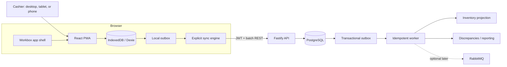

# Architecture and operations

## System shape

## Correctness boundaries

### Local checkout

`commitLocalSale` validates the local catalog and atomically writes four effects: transaction, local outbox intent, stock projection, and draft removal. It performs no network call. The receipt is only shown after that IndexedDB transaction commits.

The stable transaction identity is generated as UUIDv7 before any request. A browser installation also generates one durable device ID in IndexedDB; it is registered to one merchant and can be revoked server-side.

### Synchronization

The client selects due outbox entries in created order, at most 25 per request. Results are applied independently:

| Server result | Local action |
|---|---|
| `ACCEPTED` | Mark synced/settled and remove outbox entry |
| `ALREADY_PROCESSED` | Same successful action; this is the lost-response path |
| `REJECTED_PERMANENT` | Preserve transaction, mark failed for human attention |
| `RETRYABLE_ERROR` or transport error | Keep pending, back off exponentially with jitter |

`navigator.onLine` is only a hint. The scheduler proves availability through `/health`, runs at startup and every 15 seconds, and reacts to browser online/offline events. Checkout remains independent of the scheduler.

### Backend acceptance

One PostgreSQL transaction inserts the immutable transaction header, items, audit event, and backend outbox event. `(merchant_id, transaction_id)` is unique. A retry with the same payload returns `ALREADY_PROCESSED`; reusing the ID with different content returns `REJECTED_PERMANENT / ID_REUSE_PAYLOAD_MISMATCH`.

The worker claims events with `FOR UPDATE SKIP LOCKED`. Inventory movement has a uniqueness constraint, so processing the same outbox event again cannot deduct stock twice. Offline sales are accepted even if the projection becomes negative; that creates an admin discrepancy instead of deleting history.

## Web/PWA versus React Native

V1 should remain a PWA:

- one client codebase and deployment surface;
- fits existing cashier laptops/tablets and remains usable on phones;
- IndexedDB provides structured durable storage and transactions;
- service-worker precaching supports offline startup after first load;
- installable standalone experience without app-store delivery.

React Native becomes justified only for requirements the browser cannot meet reliably, such as vendor-specific Bluetooth/USB printer SDKs, hardened kiosk/device-management APIs, or guaranteed background execution while the app is closed. If that happens, keep the current sync contract and PostgreSQL backend; replace only the client adapter.

## Why RabbitMQ is deferred

RabbitMQ does not improve the atomic browser-to-PostgreSQL acceptance path. Putting it there would add a new failure boundary before the durable source of truth. V1 instead records downstream work in PostgreSQL in the same commit as the sale.

Introduce a broker after measurements show one or more of these:

- several independent downstream consumers need their own delivery lifecycle;
- polling/claiming the PostgreSQL outbox becomes material database load;
- reconnect bursts require a separate buffering and backpressure tier;
- worker fleets must scale independently with routing, dead-lettering, or priority queues.

The migration path is `PostgreSQL outbox → publisher → RabbitMQ → consumers`; the transaction API still commits to PostgreSQL first.

## Observability

`GET /health` proves database reachability. `GET /metrics` exposes counters, batch/latency observations, and database-backed gauges for pending backend outbox, oldest outbox lag, and open discrepancies. Use `Accept: text/plain` for Prometheus exposition.

Sync logs include request, batch, merchant, device, result per transaction, batch size, and latency. Authorization and PIN fields are redacted. The client Sync & Data screen exposes queue depth, retry count, last successful sync, device identity, storage estimate, and recent results.

For multiple API/worker replicas, move in-memory counters to a Prometheus client/collector; the database-backed gauges already represent shared state.

## Security baseline

- Operator PINs are bcrypt hashes; access tokens expire after 12 hours.
- Every data route derives merchant scope and role from the signed token.
- Devices must be registered and not revoked at bootstrap and sync time.
- Payloads and money invariants are validated server-side with Zod.
- Only admins create corrections or resolve discrepancies.
- Settled transactions have no mutation endpoint; correction is append-only with an audit event.
- Production deployment must terminate HTTPS and replace all demo secrets from `.env.example`.
