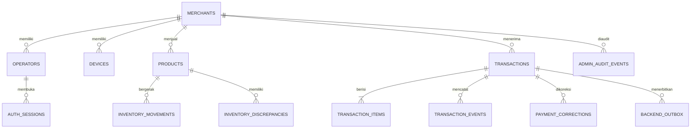

# Desain Database

COMPOS punya dua persistence boundary: IndexedDB di device untuk operational continuity, dan PostgreSQL sebagai backend source of truth.

## Local IndexedDB

Database browser `operator-pos-v3` menyimpan:

| Store                  | Fungsi                                                                     |
| ---------------------- | -------------------------------------------------------------------------- |
| `products`             | Last-known catalog dan local stock projection.                             |
| `drafts`               | Cart aktif yang disimpan berurutan.                                        |
| `transactions`         | Provisional/settled transaction beserta immutable snapshot.                |
| `outbox`               | Sync intent, state, retry count, due time, dan last error.                 |
| session/device storage | Online token, offline lease, merchant/operator, dan installation identity. |

Checkout melakukan update transaction, outbox, product projection, dan draft dalam satu Dexie transaction. Demo fixtures hanya boleh masuk ketika `VITE_DEMO_MODE=true`.

## PostgreSQL core

Tabel utama:

- `merchants`, `operators`, `devices`, `auth_sessions` untuk tenant dan access control.
- `products` untuk catalog, pricing, archive state, threshold, dan current stock projection.
- `transactions`, `transaction_items`, `transaction_events` untuk immutable accepted sales.
- `payment_corrections` untuk append-only correction tanpa rewrite transaksi asli.
- `backend_outbox`, `inventory_movements`, `inventory_discrepancies` untuk reliable eventual processing.
- `admin_audit_events` untuk perubahan account, permission, device, catalog, price, correction, dan discrepancy—tanpa PIN.

## Constraint penting

- `(merchant_id, transaction_id)` unik: business effect maksimal sekali per merchant.
- `(merchant_id, sku)` dan `(merchant_id, operator_code)` unik.
- Satu open inventory discrepancy per merchant/product.
- Inventory movement unik per source event/product agar worker replay aman.
- Query tenant selalu diawali merchant scope; code tidak memakai `SELECT *`.

## Immutability dan snapshot

Accepted transaction tidak di-update. Nama produk, SKU, unit price, quantity, subtotal, payment method, dan totals disimpan sebagai snapshot. Karena itu perubahan harga atau archive setelah sale tidak merusak histori. Correction adalah record baru dengan actor, reason, dan timestamp.

Clean baseline/reset hanya kebijakan prototype. Saat sudah menyimpan customer data, schema change harus memakai additive, reviewed, reversible migrations.

## Reporting dan insight schema

- `reporting_applied_transactions`: transaction identity yang sudah diproyeksikan; replay-safe.
- `merchant_daily_sales` dan `merchant_product_daily_sales`: read model per merchant/business date.
- `insight_jobs`: queue state, attempt, due time, requester, dan deduplication period.
- `business_insights`: immutable title/summary/recommendations dengan source yang jujur.
- `merchants.timezone`: menentukan business-date boundary; default `Asia/Jakarta`.

Migration `002` additive menambah schema dan role Owner. Migration `003` membuat reporting event
untuk confirmed transaction lama tanpa reset database.
