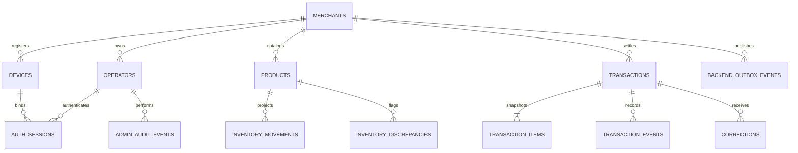

# Database Design

## PostgreSQL ERD

## Core tables

| Table                     | Purpose and invariant                                                         |
| ------------------------- | ----------------------------------------------------------------------------- |
| `merchants`               | Tenant root; merchant code unique globally.                                   |
| `operators`               | bcrypt PIN, role, active state; `(merchant_id, code)` unique.                 |
| `devices`                 | Stable installation registration and revocation.                              |
| `auth_sessions`           | Server-side JWT `jti`, expiry, last-seen, revocation reason.                  |
| `products`                | Merchant catalog, projected stock, soft archive; `(merchant_id, sku)` unique. |
| `transactions`            | Immutable settled header; PK `(merchant_id, id)` and unique invoice.          |
| `transaction_items`       | Immutable name/price/quantity snapshots.                                      |
| `transaction_events`      | Append-only acceptance/lifecycle evidence.                                    |
| `corrections`             | Admin exception records; never overwrite transaction.                         |
| `inventory_movements`     | Idempotent `(merchant, product, transaction)` projection delta.               |
| `inventory_discrepancies` | One open discrepancy per merchant/product.                                    |
| `backend_outbox_events`   | Transactional work queue claimed by workers.                                  |
| `admin_audit_events`      | Account, device, catalog, pricing, correction, inventory audit.               |

## Browser database

`operator-pos-v3` contains `products`, `transactions`, `outbox`, `syncAttempts`, `settings`, and `drafts`. Checkout writes transaction + outbox + catalog projection + draft removal in one Dexie transaction. The active cart persistence service serializes writes so an older async save cannot resurrect cleared state.

## Index strategy

- Tenant-first indexes on operator, device, product, transaction, session, discrepancy, and audit queries.
- Partial indexes for active auth sessions, unprocessed backend outbox, and one open inventory discrepancy.
- Explicit columns and mappers are used instead of `SELECT *`; SQL row casing never crosses the API boundary.

## Normalization and snapshots

Operational identity and catalog are normalized. Transaction items intentionally denormalize name and price because historical sales must survive catalog edits or archive. This is an audit snapshot, not accidental duplication.

## Ringkasan keputusan (Bahasa Indonesia)

PostgreSQL memakai merchant sebagai batas tenant di setiap constraint penting. Transaksi settled dan item snapshot tidak diubah. Correction, event, movement, dan audit bersifat append-only. IndexedDB menyimpan data kasir yang diperlukan offline dan checkout mengubah sale/outbox/draft secara atomik.
