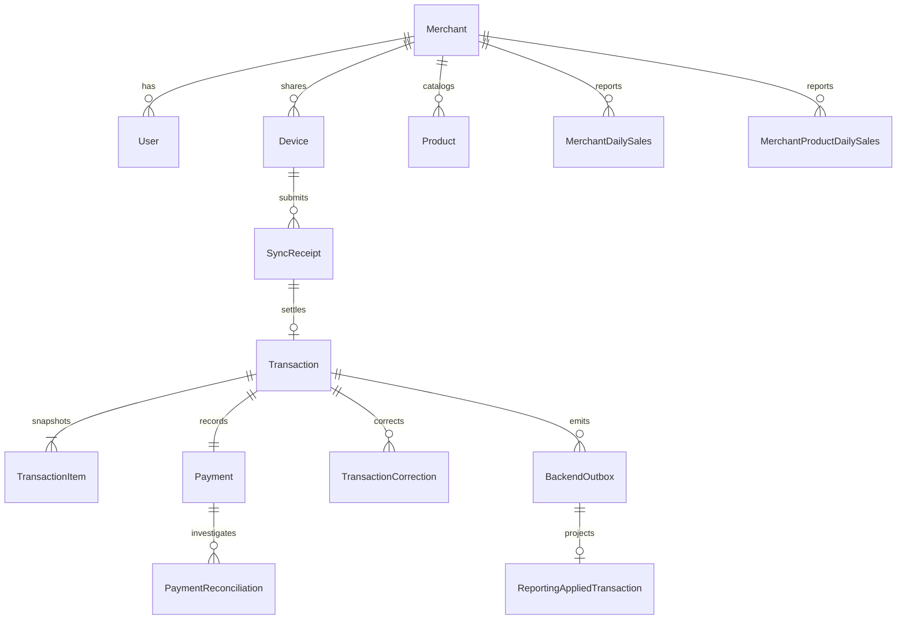

# Database Design

## PostgreSQL source of truth



## Integrity rules

- role enum only `OWNER | ENTRY | OPERATOR`;
- one active primary Owner per merchant via database constraint/index;
- unique user email and merchant-scoped product SKU;
- unique `(device_id, offline_uuid)` sync boundary plus payload hash;
- transaction original row never updated for void/correction semantics;
- transaction item stores product ID, name, SKU, unit price, catalog version snapshot;
- only one OPEN payment reconciliation per payment;
- invalid reconciliation and correction share one database transaction;
- event/projector uniqueness prevents duplicate stock/reporting effect.

## Payment model

```prisma
enum PaymentStatus {
  VERIFIED
  FAILED
}

enum ReconciliationStatus {
  OPEN
  RESOLVED_VALID
  RESOLVED_INVALID
}
```

Reconciliation stores payment/transaction reference, reason/evidence note, opener/resolver, outcome,
timestamps, and related correction when invalid. Tidak ada global `PENDING` payment queue.

## IndexedDB Operator

Tables store active catalog snapshot, durable draft, local transactions, local receipt metadata,
delivery outbox, session/offline lease, dan stable device identity. Schema version baru harus punya
explicit migration/recovery test. Logout tidak menghapus ledger/outbox/device.

## Migration policy

Prototype sekarang memakai clean baseline karena belum ada customer production. Setelah live data
ada, semua schema change wajib additive, reviewed, rollback-aware, dan diuji terhadap backup copy.
Reset command harus menolak database non-local/non-test.
