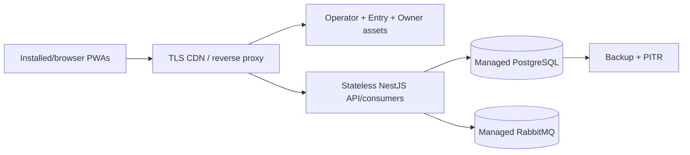

# Deployment Plan

## Recommended topology

Local/demo Docker memakai satu Nginx, one-shot migration/seed, satu API process, PostgreSQL, dan
RabbitMQ persistent volumes. Ini evaluation sandbox, bukan production topology.

## Release steps

1. `pnpm run ci:full` dan backend lint/test/build hijau.
2. OpenAPI snapshot tidak drift.
3. Build immutable hashed assets untuk tiga PWA.
4. Apply reviewed migration sebelum traffic cutover; seed hanya environment demo baru.
5. Deploy API dengan secrets dari secret manager, bukan image/repo.
6. Verify `/health`, login ketiga role, one sync settlement, conflict/reconciliation, reporting lag.
7. Observe error/queue/DB metrics; rollback app image bila gate gagal. Database rollback mengikuti
   migration-specific plan, bukan destructive reset.

## Required production controls

- TLS/HSTS, secure cookie domain, restrictive CORS/CSP;
- unique JWT/offline-lease secrets and rotation procedure;
- managed PostgreSQL backup/PITR plus restore drill;
- durable Rabbit storage, queue length/DLQ alarm, connection alarm;
- structured logs with request ID, sensitive-field redaction;
- autoscaling/capacity rules based on measured queue lag/latency;
- no public demo credentials or seed on shared production.

## Why not serverless-only frontend platforms

Static PWAs can live on any CDN, but continuous Rabbit consumer, publisher connection, retry topology,
and PostgreSQL migrations need long-running backend infrastructure. Splitting only static hosting is
valid; replacing Nest/Rabbit with short-lived functions is a separate architecture decision.
