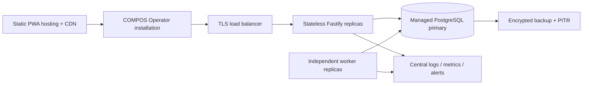

# Deployment Plan

## Production topology

Development memakai Docker Compose. CI memakai ephemeral PostgreSQL dan `operator_pos_test`. Staging meniru topology/secrets production dengan synthetic merchant. Production menyajikan immutable hashed PWA assets lewat HTTPS, memisahkan API dan worker process, serta menempatkan managed PostgreSQL di region yang sama.

## Release pipeline

1. Install dari frozen lockfile.
2. Jalankan format, type-aware lint, strict typecheck, dan unit test.
3. Reset/migrate/seed isolated test DB lalu integration test.
4. Build contracts, API, dan PWA; jalankan Playwright.
5. Publish versioned artifacts/container images.
6. Apply forward migration sebelum rolling deploy API/worker.
7. Smoke-test health, metrics, login, synthetic settlement, dan worker drain.

Clean baseline adalah prototype policy. Sebelum ada live customer data, pindah ke additive, reviewed, reversible migrations. `db:reset` tidak boleh pernah dipakai di production.

## Security, capacity, dan recovery

Gunakan TLS, secret manager, rotasi JWT/device activation secret, least-privilege DB role, encrypted backup, rate limit/WAF, private metrics endpoint, dan exact CORS origin. Jangan expose seed credentials.

Scale stateless API secara horizontal dan sesuaikan connection pool dengan batas PostgreSQL. Worker bisa ditambah melalui safe event claiming. RabbitMQ atau broker lain baru ditambahkan ketika independent consumer, replay, atau throughput sudah menjadi bottleneck terukur.
