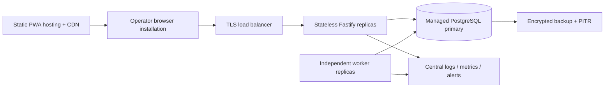

# Deployment Plan

## Production topology

## Environments

Development uses Docker Compose. CI uses an ephemeral PostgreSQL service plus `operator_pos_test`. Staging mirrors production secrets/topology with synthetic merchants. Production serves immutable hashed PWA assets over HTTPS, runs API and worker separately, and uses managed PostgreSQL in the same region.

## Release pipeline

1. Install from frozen lockfile.
2. Format, type-aware lint, strict typecheck, unit tests.
3. Reset/migrate/seed isolated test database; run integration.
4. Build contracts, API, and PWA; run Playwright.
5. Publish versioned artifacts/container images.
6. Apply forward migration before rolling API/worker deployment.
7. Smoke health, metrics, login, one synthetic settlement, and worker drain.

The clean baseline is prototype policy. Before live customer data, switch to additive, reviewed, reversible migrations; never use `db:reset` in production.

## Security and secrets

Use TLS, a secret manager, rotated JWT/device activation secrets, least-privilege DB roles, encrypted storage/backups, rate limiting/WAF, and restricted metrics endpoints. Do not expose seed credentials. Configure exact CORS origins.

## Capacity path

Scale stateless APIs horizontally; index tenant-first queries; tune pool size against database connections. Scale workers through safe event claiming. Add a broker only when independent consumers, replay, or throughput are measured bottlenecks rather than anticipated complexity.

## Ringkasan keputusan (Bahasa Indonesia)

PWA di-host statis, API dan worker dipisah, PostgreSQL managed menjadi source of truth. CI wajib hijau sebelum deploy rolling. Clean reset hanya untuk prototype; production harus memakai migration additive. Secrets, TLS, backup/PITR, CORS ketat, dan observability wajib sebelum go-live.
