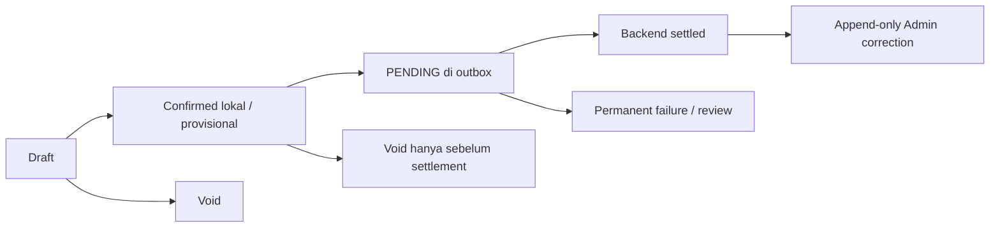

# Product Principles: Sync Without Signal

## Masalah yang diselesaikan

Kasir harus tetap melayani pembeli saat internet lambat atau benar-benar putus. Di saat yang sama,
merchant bisa punya lebih dari satu device, payment method punya tingkat verifikasi berbeda, dan
backend tidak boleh membuat transaksi ganda ketika request di-retry. Jadi problem-nya bukan sekadar
“bisa offline”, tetapi menjaga consistency sambil tetap available.

## Invariants COMPOS

COMPOS dibangun di atas empat invariants:

1. **Local sale tidak boleh hilang.** Receipt baru muncul setelah sale + outbox tersimpan atomically.
2. **Retry tidak boleh menggandakan business effect.** Stable transaction ID, payload hash, dan
   merchant-scoped unique constraint menangani lost response.
3. **Status harus jujur.** Offline receipt bersifat provisional sampai backend mengembalikan
   `ACCEPTED` atau `ALREADY_PROCESSED`.
4. **Conflict tidak boleh diam-diam dioverwrite.** Settled sale immutable; payment correction dan
   stock reconciliation dilakukan append-only oleh Admin.

## Actor dan scope

- **Kasir / OPERATOR:** login, checkout, melihat local transactions dan sync status, void sebelum
  settlement.
- **Merchant ADMIN:** semua kemampuan kasir plus mengelola user, device, catalog/pricing,
  correction, discrepancy, dan audit history dalam merchant-nya.
- **API + worker:** menerima transaction secara idempotent, menyimpan immutable history, lalu
  memproyeksikan inventory secara eventual.

React Native, dynamic QRIS gateway verification, cross-device stock reservation, dan external
message broker berada di luar scope prototype.

## Payment semantics

| Method      | Makna saat checkout                                                              |
| ----------- | -------------------------------------------------------------------------------- |
| Cash        | Bisa diverifikasi sistem dari tendered amount dan change.                        |
| Static QRIS | Operator menyatakan pembayaran sudah dilihat; backend tidak punya gateway proof. |
| Transfer    | Operator menyatakan transfer sudah dicek; tetap subject to correction.           |

UI dan receipt tidak boleh memberi kesan QRIS/Transfer sudah bank-verified kalau memang belum ada
payment provider integration.

## Lifecycle transaksi

Inventory baru berubah di source of truth setelah backend acceptance dan worker processing. Device
yang offline boleh menjual berdasarkan last-known catalog/stock sehingga negative stock mungkin
terjadi. Itu trade-off yang eksplisit: counter availability diprioritaskan, lalu discrepancy
diselesaikan lewat audited reconciliation.

## Kriteria sukses produk

COMPOS dianggap menjaga jaminan utamanya ketika demo dan automated tests membuktikan offline
checkout, reload recovery, reconnect settlement, lost-response retry, partial batch, multi-device
operation, session/device revocation, immutable correction, eventual inventory reconciliation,
reporting convergence, dan workload isolation saat Owner membaca analytics.
