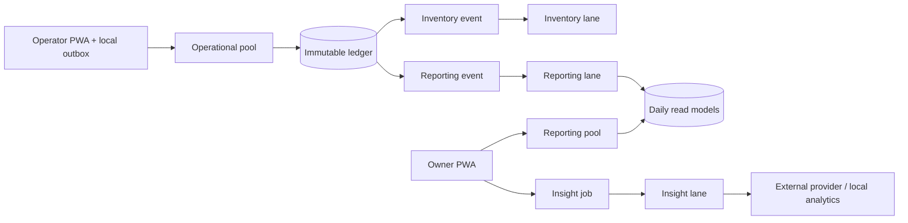

# Scaling Strategy

COMPOS scale berdasarkan **access pattern**, bukan jumlah service. Operational settlement, Admin
mutation, Owner reporting, dan background projection punya latency/consistency budget berbeda, tapi
tetap hidup dalam modular monolith, satu PostgreSQL, satu API deployment, dan satu worker deployment.

## Workload matrix

| Workload                | Pola akses                          | Consistency                  | Budget default                     |
| ----------------------- | ----------------------------------- | ---------------------------- | ---------------------------------- |
| Sync + immutable ledger | Burst write, retry, lost response   | Strong + idempotent          | pool 12, statement timeout 2 detik |
| Admin                   | Low-volume mutation + audit         | Strong                       | pool 4, timeout 5 detik            |
| Owner dashboard         | Date-range aggregate read           | Eventual, freshness terlihat | read pool 4, timeout 3 detik       |
| Worker                  | Queue claim + idempotent projection | Eventual                     | pool 4, lane independen            |
| External insight        | Slow/unreliable network call        | Async, fallback eksplisit    | timeout 15 detik, max 3 attempt    |

Total connection budget per API replica:

```text
API replicas × (operational + admin + reporting) + worker replicas × worker
```

Default satu API + satu worker adalah `12 + 4 + 4 + 4 = 24` potential connections. Render sandbox
mengecilkan API menjadi `8 + 2 + 2`, jadi total potential connections `16`. Pool dibuat terpisah;
report yang lambat tidak boleh mengambil slot settlement.

## Write path dan read path



Reporting memakai `reporting_applied_transactions(merchant_id, transaction_id)` sebagai idempotency
boundary. Replay event boleh terjadi, tetapi aggregate hanya berubah sekali. `VOIDED` transaction
tercatat di ledger tetapi tidak masuk sales projection. Migration `003` membuat event backfill untuk
settled data yang sudah ada sebelum read model diperkenalkan.

## Worker lanes

Satu process menjalankan tiga loop independen:

- inventory: stock movement dan discrepancy;
- reporting: daily sales dan product performance;
- insight: claim job, extract aggregate features, provider/fallback, immutable result.

External provider wait hanya menahan promise lane insight. Inventory dan reporting loop tetap maju.
Manual generation dideduplicate oleh merchant + period window. Tanpa provider secret, hasil selalu
deterministic dan diberi source `LOCAL_ANALYTICS`.

## Rate dan data exposure

- Reporting: 30 request/menit per authenticated session.
- Insight generation: 2 request/hari per session, dengan DB deduplication per merchant/window.
- Admin mutation: 60 request/menit per session.
- Provider hanya menerima gross/net sales, transaction count, AOV, period, dan top products. Tidak
  ada PIN, token, operator identity, device, customer, atau raw transaction.

## Evidence dan target

`pnpm test:load` membuat 50 isolated merchant selama 15 detik, menjalankan concurrent settlement,
Admin read, Owner report, dan insight job, lalu membandingkan read model dengan canonical ledger.
Hasil JSON berisi environment metadata, sample count, p95, lost/duplicate evidence, dan convergence.

| Signal                         | Target supported environment |
| ------------------------------ | ---------------------------- |
| Local enqueue construction p95 | `< 500 ms`                   |
| Backend settlement p95         | `< 750 ms`                   |
| Owner dashboard p95            | `< 1.5 s`                    |
| Lost/duplicate settlement      | `0`                          |
| Reporting convergence          | Sama dengan canonical ledger |

Capacity profile `pnpm test:load:500` menjalankan 500 merchant selama lima menit dan harus dijalankan
eksplisit pada host yang dicatat spesifikasinya. Angka laptop bukan production capacity promise.

## Trigger scale berikutnya

| Tambahan infrastruktur | Baru dipertimbangkan ketika                                                            |
| ---------------------- | -------------------------------------------------------------------------------------- |
| Read replica           | Reporting p95/CPU melewati budget setelah index, query, read model, dan pool tuning    |
| Broker                 | PostgreSQL outbox claim menjadi bottleneck terukur atau fan-out lintas banyak consumer |
| Redis rate limiter     | API multi-replica dan process-local counter tidak cukup untuk abuse protection         |
| Service split          | Team ownership/deployment isolation lebih bernilai daripada operational cost           |

Relative cost dimulai dari `1 API + 1 worker + 1 PostgreSQL`. Replica/broker menambah biaya,
operational surface, observability, backup, dan failure mode; keputusan harus memakai baseline nyata.
