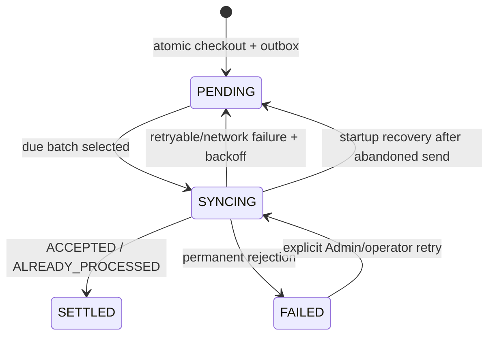

# Offline Synchronization Protocol

## Local state machine



## Envelope

`POST /v1/sync/transactions` accepts `schemaVersion: 1`, merchant/device/batch identity, and 1–25 transaction candidates. Every transaction includes a stable client ID, device timestamp, payment semantics, money totals, and item snapshots. Response order matches input order and each result is independent.

| Result               | Local transition                                                  |
| -------------------- | ----------------------------------------------------------------- |
| `ACCEPTED`           | Mark settled/synced and delete outbox.                            |
| `ALREADY_PROCESSED`  | Same successful transition; protects lost responses.              |
| `RETRYABLE_ERROR`    | Increment retry, persist error, set exponential backoff + jitter. |
| `REJECTED_PERMANENT` | Mark failed; retain evidence for explicit review.                 |

## Exactly-once business effect

Transport is at-least-once. Business acceptance behaves exactly once through `(merchant_id, transaction_id)` uniqueness plus a canonical payload hash. Same ID/same payload returns the first receipt time; same ID/changed payload returns `ID_REUSE_PAYLOAD_MISMATCH` and never overwrites history.

## Lost-response sequence

```mermaid
sequenceDiagram
  participant D as Device outbox
  participant A as API
  participant P as PostgreSQL
  D->>A: transaction T / payload H
  A->>P: insert T + items + event + backend outbox
  P-->>A: COMMIT
  A--xD: HTTP response lost
  D->>A: retry T / payload H
  A->>P: find T and compare H
  A-->>D: ALREADY_PROCESSED
  D->>D: mark settled; remove outbox
```

## Scheduler and failures

Only due records are queried and bulk-loaded once per batch. Startup recovers abandoned `SYNCING` records. Browser online events, periodic probes, and manual reconnect feed one single-flight sync service. Authentication errors pause sending without deleting queued sales. Mass reconnect is naturally bounded to 25-item batches.

## Ringkasan keputusan (Bahasa Indonesia)

Jaringan dianggap at-least-once, sehingga exactly-once dicapai pada business effect menggunakan ID stabil, unique constraint, dan payload hash. Respons sukses yang hilang aman karena retry menghasilkan `ALREADY_PROCESSED`. Failure retry memakai exponential backoff + jitter dan queued sale tidak pernah dihapus karena masalah autentikasi.
