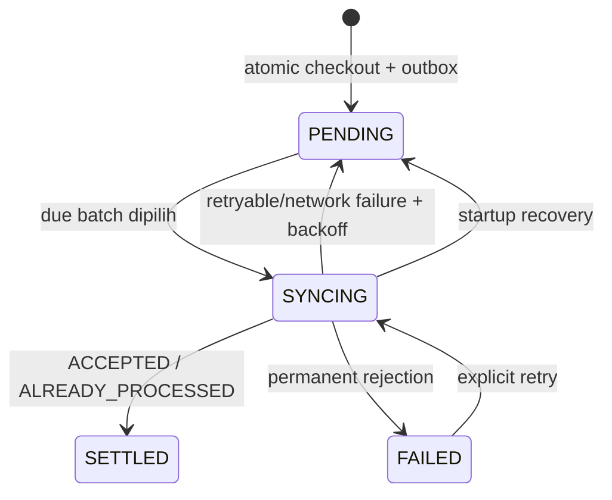

# Protokol Offline Sync

## Local state machine



## Sync envelope

`POST /v1/sync/transactions` menerima `schemaVersion: 1`, identity merchant/device/batch, dan 1–25 candidates. Setiap transaction membawa stable client ID, device timestamp, payment semantics, money totals, dan item snapshots. Result setiap candidate independen, tetapi urutan response tetap sama dengan input.

| Result               | Local transition                                                |
| -------------------- | --------------------------------------------------------------- |
| `ACCEPTED`           | Tandai settled/synced, lalu hapus outbox item.                  |
| `ALREADY_PROCESSED`  | Transition sukses yang sama; ini melindungi lost response.      |
| `RETRYABLE_ERROR`    | Naikkan retry, simpan error, atur exponential backoff + jitter. |
| `REJECTED_PERMANENT` | Tandai failed dan pertahankan evidence untuk review.            |

## Exactly-once business effect

Transport tetap at-least-once. Exactly-once dicapai pada business effect lewat unique `(merchant_id, transaction_id)` dan canonical SHA-256 payload hash. ID sama + payload sama mengembalikan first receipt time; ID sama + payload berubah menghasilkan `ID_REUSE_PAYLOAD_MISMATCH` dan tidak pernah overwrite histori.

```mermaid
sequenceDiagram
  participant D as Device outbox
  participant A as API
  participant P as PostgreSQL
  D->>A: transaction T / payload H
  A->>P: insert transaction + items + event + outbox
  P-->>A: COMMIT
  A--xD: successful response hilang
  D->>A: retry T / payload H
  A->>P: find T dan compare H
  A-->>D: ALREADY_PROCESSED
  D->>D: mark settled; remove outbox
```

## Scheduler dan failure behavior

COMPOS mengambil outbox yang sudah due, dari paling lama, maksimal 25 item per batch. Scheduler jalan saat startup, browser `online` event, manual reconnect, dan interval 15 detik. `/health` probe punya timeout 3 detik dan sync service single-flight agar trigger tidak saling tabrak.

Hanya due records yang di-query, lalu transactions di-bulk-load dan di-map sekali. `retryCount` baru bertambah setelah failure. Startup mengembalikan abandoned `SYNCING` ke `PENDING`. Auth expired atau device revoked mem-pause sync dan meminta login ulang; queued sales tetap aman di device.

API memproses candidates secara concurrent dalam batas batch, tetapi menyusun kembali hasil sesuai input order. Satu item gagal tidak menggagalkan item lain.
