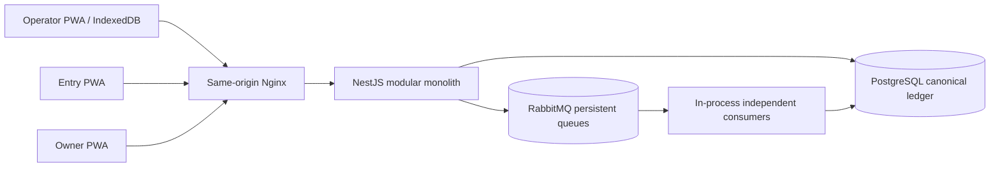

# System Architecture

## Runtime topology

Local hot-reload memisahkan Vite dan API. Production-like Docker menyajikan semua browser app lewat
Nginx di satu origin. Backend tetap satu NestJS deployable agar failure surface dan cost kecil; module
boundaries dipakai sebelum service split.

## Browser boundaries

### Operator PWA

`app/` compose routes/shell, `features/` memiliki use case, `infrastructure/` memiliki API dan Dexie,
`shared/` hanya UI/helper netral. Confirm sale adalah application service dengan IndexedDB transaction
boundary. Service worker scope `/` tidak intercept `/entry/`, `/owner/`, `/api/`, `/health`, atau
`/metrics`.

### Entry dan Owner PWA

Keduanya online-first, punya base dan service-worker scope sendiri. Cached shell boleh terbuka offline,
tetapi mutation/report freshness tidak dijanjikan tanpa API. Wrong-role response memberi link ke app
yang benar.

## Backend modules

- auth/session/offline lease;
- merchant users dan shared devices;
- catalog dan inventory adjustment;
- sync receipt, dispatcher, consumer, retry/DLQ;
- immutable transaction, conflict, correction;
- payment exception reconciliation;
- transactional outbox dan reporting projection;
- health, audit, OpenAPI.

Controller parse/authenticate/call service. Prisma service/repository memiliki persistence concern;
authorization dan transition policy tinggal di application/domain service.

## Consistency boundaries

| Boundary                   | Consistency                                   |
| -------------------------- | --------------------------------------------- |
| Local checkout             | Strong, single IndexedDB transaction          |
| API receipt acceptance     | Strong DB receipt + confirmed durable publish |
| Transaction settlement     | Strong PostgreSQL transaction, async dari UI  |
| Inventory                  | Eventual; conflict explicit                   |
| Reporting                  | Eventual idempotent projection                |
| Catalog on offline counter | Last-known snapshot                           |

## Failure model

- API unreachable: outbox stays local dan retry terjadwal.
- HTTP response lost: stable key/payload retry me-reuse receipt.
- Rabbit unavailable: API health degraded; receipt dispatcher/retry resumes later.
- Consumer crash before commit: Rabbit redelivery; no business effect yet.
- Consumer crash after commit before ACK: redelivery hits idempotency boundary.
- Permanent message failure: DLQ marks receipt `FAILED`; Owner sees it.
