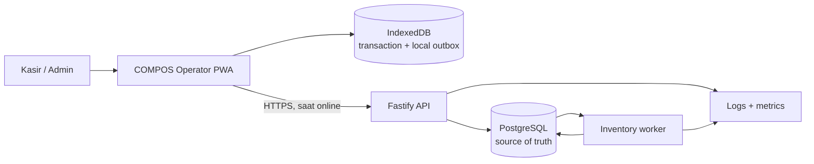
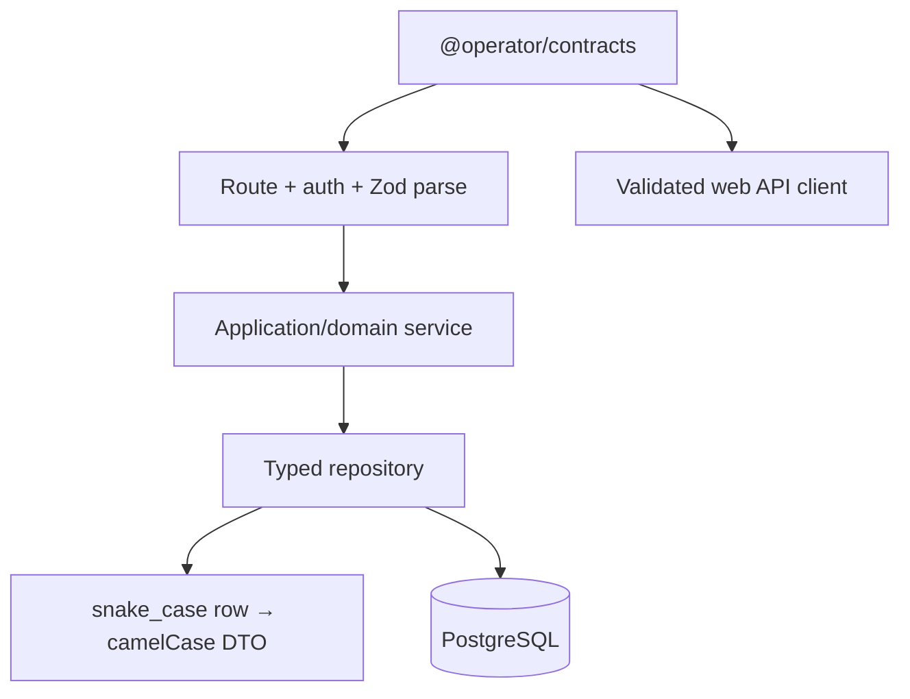

# Arsitektur Sistem

## Big picture



COMPOS memakai local-first write path. UI tidak menunggu server untuk menyatakan checkout berhasil secara lokal; ia menunggu satu IndexedDB transaction yang menyimpan sale, outbox intent, product-stock projection, dan pembersihan draft. Backend kemudian menjadi source of truth setelah settlement.

## Web boundary

```text
app/                         routing dan composition root
features/                    UI + use case per business feature
  auth/ checkout/ catalog/ sync/ transactions/
  admin-users/ admin-catalog/ reconciliation/
infrastructure/
  api/                       validated transport
  persistence/               Dexie repositories, session, device
shared/ui/                   reusable presentation components
shared/lib/                  kecil, domain-neutral
```

Page hanya compose feature component/hook. Checkout construction berada di `confirmSale` application service, bukan event handler JSX. Zustand menyimpan ephemeral UI state; data durable masuk repository. Ordered draft persistence mencegah write lama menimpa state baru atau menghidupkan kembali cart yang sudah cleared.

## API boundary

API disusun sebagai vertical modules: auth, devices, catalog, transactions, reconciliation, dan inventory. Route hanya melakukan authenticate, parse canonical contract, memanggil service, lalu serialize response. SQL dan row mapping tinggal di typed repository. Semua database transaction memakai satu `withTransaction` helper.



## Checkout sampai inventory

1. Device membuat UUIDv7 dan immutable item/payment snapshot.
2. Satu IndexedDB transaction menyimpan sale + local outbox sebelum receipt tampil.
3. Sync service mengirim due candidates dalam batch maksimal 25.
4. API menerima setiap candidate secara independen; accepted transaction, items, event, dan backend outbox tersimpan dalam satu PostgreSQL transaction.
5. Worker memproses inventory event secara idempotent.
6. Kalau stock menjadi negatif, sistem membuka discrepancy untuk ditinjau Admin.

Inventory sengaja eventual. Memaksa cross-device reservation ketika offline akan mengorbankan checkout availability yang menjadi jaminan utama produk.

## Boundary yang sengaja tidak dibuat

Tidak ada generic shared package, ORM layer, RabbitMQ, atau domain framework. Abstraction baru harus menyelesaikan duplication nyata di minimal dua consumer, bukan sekadar terlihat enterprise.

## Owner intelligence dan workload isolation

COMPOS Owner adalah PWA terpisah di port `5174` atau hosted path `/owner/`. Dashboard tidak menjalankan
aggregate scan ke immutable ledger. Transaction acceptance menerbitkan inventory dan reporting event;
reporting lane mengisi daily/product read models secara idempotent, lalu reporting pool membacanya.

API memakai operational pool (12/2 detik), Admin pool (4/5 detik), dan reporting pool (4/3 detik).
Worker punya pool 4 dan independent inventory, reporting, serta insight loops. External provider wait
tidak menahan dua lane lain. Detail connection math dan scale trigger ada di
[Scaling Strategy](scaling_strategy.md).
