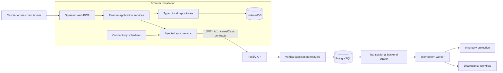
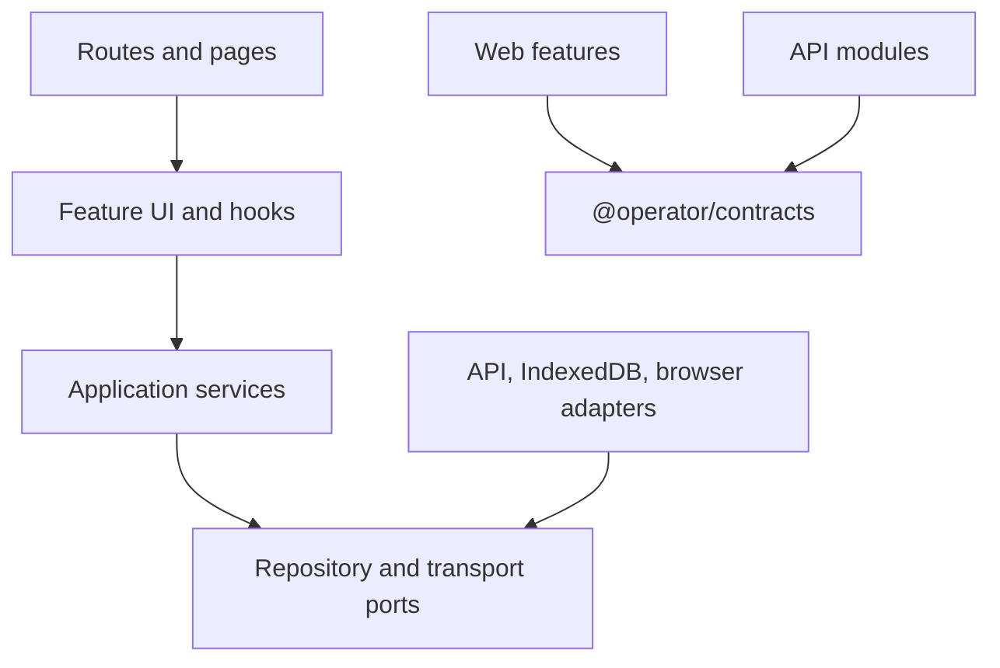
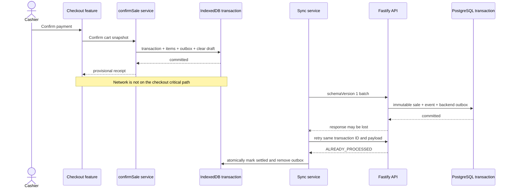
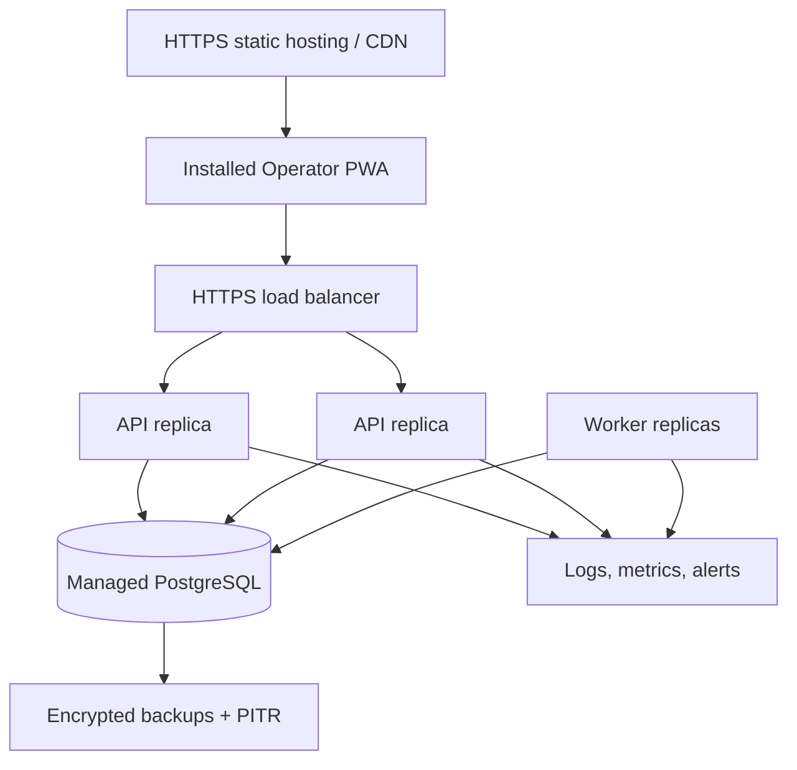

# System Architecture

## Logical architecture

## Dependency rule

Pages compose features; they do not construct transaction records, access Dexie tables, or interpret database-shaped fields. Features depend on narrow ports. Infrastructure implements those ports. The contracts package is the only cross-application runtime dependency and contains no persistence or framework logic.

## Checkout and sync sequence

## Deployment shape

## Ringkasan keputusan (Bahasa Indonesia)

Checkout hanya bergantung pada transaksi IndexedDB lokal; jaringan bukan bagian dari jalur kritis. Halaman UI memakai feature service, bukan Dexie atau SQL langsung. API dipecah per modul vertikal dan PostgreSQL tetap menjadi sumber kebenaran. Worker memproses transactional outbox secara idempoten, sehingga inventori akhirnya konsisten tanpa membuat transaksi kasir menunggu.
