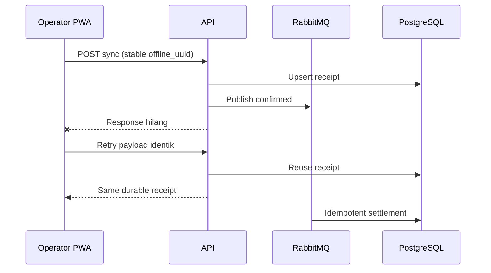

# User Stories & Core Flows

## Operator

- Sebagai Operator, aku bisa login online di shared counter lalu lanjut memakai session terakhir saat
  internet hilang, supaya pergantian shift tidak memblokir penjualan yang sedang berjalan.
- Aku bisa checkout dan mendapatkan receipt lokal tanpa menunggu backend.
- Aku bisa melihat sale masih provisional, sudah queued, conflict, failed, atau settled.
- Data queued tidak hilang setelah reload/logout; operator switch baru membutuhkan online login.

## Entry

- Sebagai Entry, aku bisa mengelola nama, SKU, kategori, harga, image, dan archive product.
- Aku bisa menyesuaikan stock dengan reason dan melihat history adjustment.
- Perubahan catalog tidak mengubah historical transaction snapshot.

## Owner

- Sebagai Owner, aku bisa membuat/deactivate Entry/Operator dan me-revoke device merchant.
- Aku bisa melihat sync conflict/failure, retry failure yang eligible, lalu confirm atau void conflict.
- Aku membuka reconciliation hanya ketika payment yang sudah verified dicurigai salah.
- Jika valid, aku menutup case tanpa mengubah transaction; jika invalid, sistem membuat payment
  failed dan append-only void/correction secara atomik.
- Aku melihat sales dashboard beserta `data_as_of` dan projection lag agar tahu freshness datanya.

## Lost-response flow

