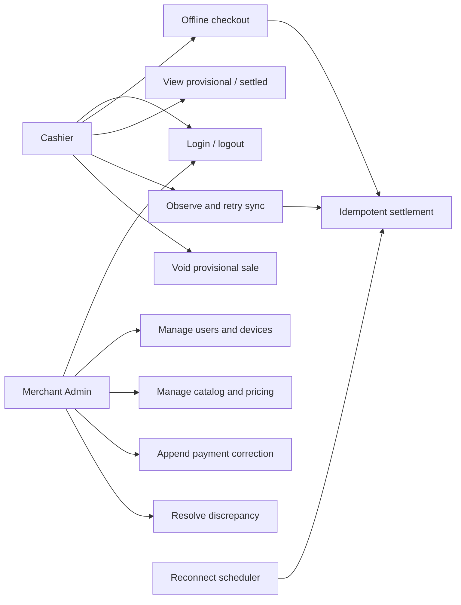

# User Stories and Use Cases

## Cashier stories

| ID    | Story                                                                  | Acceptance                                                                 |
| ----- | ---------------------------------------------------------------------- | -------------------------------------------------------------------------- |
| US-01 | As a cashier, I can authenticate on a registered device.               | Valid merchant/code/PIN opens only the assigned merchant.                  |
| US-02 | As a cashier, I can complete Cash, QRIS, or Transfer checkout offline. | Receipt appears after atomic local commit without awaiting the API.        |
| US-03 | As a cashier, I can see provisional and settled state.                 | Receipt, ledger, detail, and sync queue expose both states.                |
| US-04 | As a cashier, I can reload or restart without losing work.             | Cart draft, catalog, transactions, and outbox are restored from IndexedDB. |
| US-05 | As a cashier, my queued sales settle automatically.                    | Scheduler probes health, batches due items, and applies per-item outcomes. |
| US-06 | As a cashier, I can retry a failed item safely.                        | Retry keeps the same ID; duplicate acceptance returns success.             |
| US-07 | As a cashier, I can void only a provisional sale.                      | Local stock projection is restored and void remains in the outbox.         |

## Admin stories

| ID    | Story                                                        | Acceptance                                                                    |
| ----- | ------------------------------------------------------------ | ----------------------------------------------------------------------------- |
| US-08 | As an Admin, I create and deactivate cashier/Admin accounts. | Merchant scope, PIN policy, self/final-Admin guards apply.                    |
| US-09 | As an Admin, I reset a PIN or revoke a device.               | Relevant server sessions are immediately invalidated.                         |
| US-10 | As an Admin, I manage catalog and price.                     | SKU is unique per merchant; archive is soft; stock is not editable here.      |
| US-11 | As an Admin, I correct a settled payment exception.          | Original transaction remains unchanged; a new correction/audit record exists. |
| US-12 | As an Admin, I resolve an inventory discrepancy.             | Resolution and optional physical stock adjustment are audited.                |

## Use-case diagram

## Lifecycle workflows

1. Login online registers/validates device and stores a 12-hour token plus 72-hour offline lease.
2. Checkout snapshots items/prices and commits sale/outbox locally; receipt is provisional.
3. Reconnection submits at most 25 due records. Each item independently succeeds, fails permanently, or schedules backoff.
4. Backend acceptance appends events/outbox in one PostgreSQL transaction and makes the sale settled/immutable.
5. Worker projects stock; a negative result creates one open discrepancy per product.

## Ringkasan keputusan (Bahasa Indonesia)

Kasir berfokus pada login, checkout offline, status transaksi, retry aman, dan void provisional. Admin mengelola akun/device, katalog/harga, correction pembayaran, dan discrepancy inventori. Semua alur Admin dibatasi merchant dan dicatat sebagai audit.
