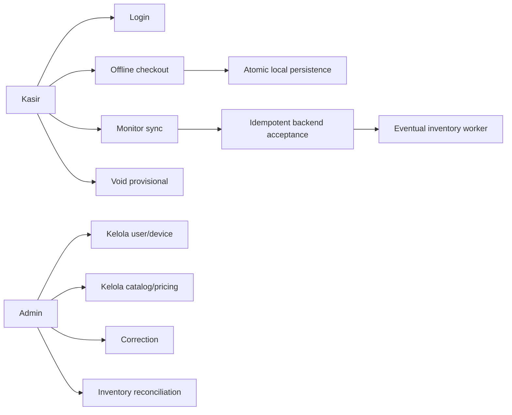

# User Stories dan Use Cases

## Kasir

### US-01 — Tetap jualan saat offline

Sebagai kasir, aku ingin mengonfirmasi checkout tanpa koneksi agar antrean pelanggan tetap jalan. Sale harus tersimpan durable sebelum provisional receipt muncul dan status offline harus terlihat jelas.

### US-02 — Pulih setelah browser reload

Sebagai kasir, aku ingin cart, catalog, confirmed sales, dan queue tetap ada setelah reload atau restart supaya tidak perlu input ulang dan tidak kehilangan transaksi.

### US-03 — Sync otomatis

Sebagai kasir, aku ingin queued sales terkirim otomatis ketika koneksi balik tanpa menekan tombol per transaksi. Retry tidak boleh membuat duplicate settlement.

### US-04 — Payment yang jujur

Sebagai kasir, aku ingin Cash, Static QRIS, dan Transfer punya validation/label yang jelas supaya provisional receipt tidak disalahartikan sebagai bank verification.

### US-05 — Void sebelum settled

Sebagai kasir, aku ingin membatalkan transaksi provisional yang salah, tetapi tidak boleh mengubah transaksi yang sudah diterima backend.

## Merchant Admin

### US-06 — Kelola tim kasir

Sebagai Admin, aku ingin membuat Operator/Admin, mengubah nama/role, reset PIN, dan deactivate account dalam merchant sendiri. Sistem harus mencegah self-demotion/deactivation dan menjaga minimal satu active Admin.

### US-07 — Kendalikan device

Sebagai Admin, aku ingin melihat dan me-revoke device merchant. Revocation harus menginvalidasi related sessions tanpa menghapus queued data lokal.

### US-08 — Kelola catalog dan harga

Sebagai Admin, aku ingin membuat, edit, archive, dan restore product. SKU harus unik per merchant; stock tidak boleh diedit lewat catalog screen; historical sale tetap memakai snapshot lama.

### US-09 — Koreksi tanpa rewrite history

Sebagai Admin, aku ingin mencatat payment correction dan resolve inventory discrepancy dengan reason/note supaya original event tetap immutable dan audit-able.

## Sistem

### US-10 — Lost response yang aman

Sebagai sistem, ketika backend sudah commit tetapi response hilang, retry ID/payload yang sama harus menghasilkan `ALREADY_PROCESSED`, bukan row baru.

### US-11 — Partial batch

Sebagai sistem, satu candidate yang invalid tidak boleh menggagalkan candidate lain dalam batch, dan response order harus mengikuti request order.

### US-12 — Offline lease

Sebagai sistem, checkout boleh lanjut sampai 72 jam sejak successful online authentication. Sesudah lease habis, existing data tetap readable/queued tetapi sale baru menunggu re-authentication.

## Use-case map

## Journey ringkas

1. Device diaktivasi, operator login online, lalu session dan offline lease tersimpan.
2. Catalog di-refresh. Ketika offline, kasir memakai last-known catalog.
3. Confirm sale membuat provisional transaction dan outbox atomically.
4. Scheduler mengirim due batch saat connectivity sehat.
5. Accepted sale menjadi settled; worker menyelesaikan stock projection.
6. Kalau ada exception, Admin menangani correction/discrepancy lewat append-only flow.
